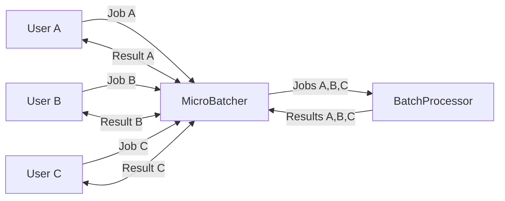

# Micro-batching library

A micro-batch processor creates groups incoming requests which are sent to a batch processor frequently.
Micro-batches are sent for processing based on configurable criteria including the input job queue length and a
periodic trigger interval.



The purpose of the library is to group individual requests (job) into batches. These will be submitted to the downstream
service when either of the following conditions are met:

* A batch size reaches a certain threshold
* Periodically, regardless of batch size

Jobs are submitted to the micro-batch processor via the `Submit(job Job[T]) Result[R]`. This returns when the
micro-batch has been processed and the result is available.

# Usage

The `MicroBatcher` is created via the `NewMicroBatcher(conf UConfig, processor *BatchProcessor[T, R], logger *slog.Logger)`
function. The logger is optional and `nil` can be provided which will disable logging.

## Importing

This package has not been published to a package repo. See roadmap for more info

## Batch Processor

This library is designed for use with a Batch Processor which fulfils the following contract.

```go
package types

type Id int

type Result[T any] struct {
	Id  Id
	Ok  T
	Err error
}

type Job[T any] struct {
	Id   Id
	Data T
}

type BatchProcessor[T any, R any] interface {
	Process(jobs []Job[T]) []Result[R]
}
```

## Example Usage

An example of how to use the `MicroBatcher` library is shown below.
The `mock.NewEchoService` returns the `Job` `Data` sent to it as `Result` `OK` message.

```go
package main

import (
	"cheyne.nz/ubatch/internal/mock"
	"cheyne.nz/ubatch/pkg/ubatch"
	"cheyne.nz/ubatch/pkg/ubatch/types"
	"fmt"
	"log/slog"
)

func main() {
	log := slog.Default()
	batchProcessor := mock.NewEchoService[string](0)
	microBatcher := ubatch.NewMicroBatcher(ubatch.DefaultConfig, &batchProcessor, log)
	microBatcher.Start()
	job := types.Job[string]{Data: "Hello", Id: 1}
	r := microBatcher.Submit(job)
	fmt.Printf("Got result: %+v\n", r)
	microBatcher.Shutdown()
}

```

See further examples [here](example).

# Config

This library can be configured via `ubatch.UConfig`. The configuration options and the values for the default config are
shown below. 

```go
UConfig{
	Batch: BatchTriggerOptions{
		// Trigger a micro-batch whenever the input queue reaches this length
		Threshold: 0,
		// Trigger a micro-batch periodically at this Interval if the input queue length is 1 or more.
		Interval: 1 * time.Second,
	},
	Input: InputOptions{
		ChannelOptions{
			// The size of the input receiver channel. Note, the default of 1 should be fine for most scenarios.
			1,
		},
		QueueOptions{
			// Default size for the input receiver queue. The queue will grow automatically as necessary.
			Size: 16,
		},
	},
}
```

# Testing

Tests can be run via your IDE or on the command line as follows.

```sh
sh
cd pkg/ubatch
go test
```

The tests use a common `*slog.Logger` which has been configured at `slog.LevelInfo`. The log level can be
increase/decreased, and the logger can even be replaced with a `nil` value.

The **feeder** concept popularized in [Gatling](https://docs.gatling.io/reference/script/core/session/feeders/)
is used to create the jobs used for the concurrency tests.

# Roadmap

The roadmap of contains possible future enhancements / next steps for this library.

## Publish package

There are currently no plans to publish this package. It was created as an exercise and for fun.

## Split InputReceiver and MicroBatcher into separate modules

The `MicroBatcher` and `InputReceiver` are configured slightly differently. The `InputReceiver` uses `IRInputOptions`
which contains the `Threshold` setting which triggers events when the input queue reaches that length.
The corresponding `Threshold` setting for `MicroBatcher` is configured in `BatchOptions`. `MicroBatcher` does not
use `IRInputOptions`, instead preferring the struct `InputOptions` so to avoid having the `Threshold` set in two places.

The `InputReceiver` and its `IRInputOptions` public. They should be moved to their own module so that this becomes an
implementation detail, and not part of the MicroBatcher API.

## Handling for Duplicate job IDs

The library assumes that each submitted job has a unique ID. To improve the API for consumers, ensure that the library
rejects any new Jobs which have the same ID as one already being processed. It should log a warning when this scenario
occurs.

## Make InputReceiver and MicroBatcher reconfigurable

Currently, these components are configured when they are created. A small improvement would be to allow their config to
to be dynamically changed.

## Further mock Batch Processors (to aid testing)

To fully explore the performance / behaviour and edge cases of the `MicroBatcher`, additional mock Batch Processors are
required. These can simulate behaviours such as dropped requests (no response), timeouts, and other errors.

## Versioning / Release notes

Versioning / Release notes could be added via [Release Please](https://github.com/googleapis/release-please) by using
[Conventional Commits](https://www.conventionalcommits.org/en/v1.0.0/).
